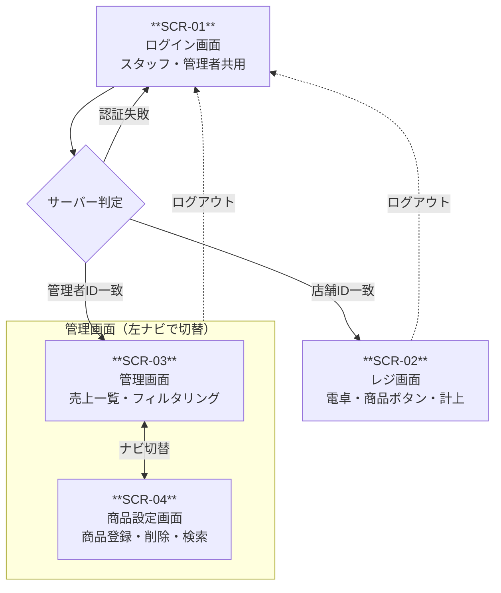
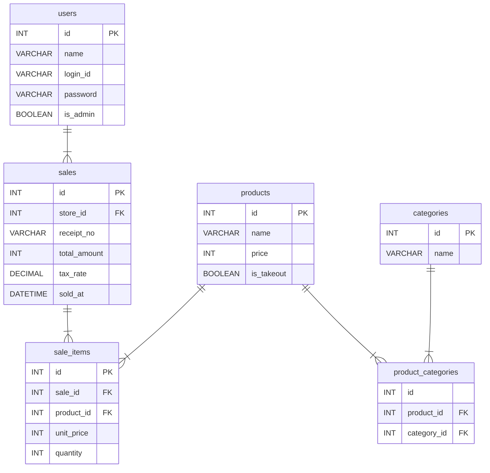

# 基本設計書

**バージョン：** 1.0

**作成日：** 2026/04/24

**更新日：** 2026/04/24

**ステータス：** 作成中

---

## 画面一覧整理

| 画面ID | 画面名 | 主な機能 | 遷移元 | 遷移先 | 優先度 |
| --- | --- | --- | --- | --- | --- |
| **SCR-01** | ログイン画面 | スタッフ用・管理者用ログインフォーム（店舗ID・PW or 管理ID・PW） | なし（エントリポイント） | SCR-02（スタッフログイン成功）
SCR-03（管理者ログイン成功） | P1 |
| **SCR-02** | レジ画面 | 電卓操作・商品ボタン（カテゴリ別・TO/店内）・注文明細・お釣り計算・計上モーダル | SCR-01（スタッフログイン成功） | SCR-01（ログアウト） | P1 |
| **SCR-03** | 売上管理画面 | 売上一覧（店舗・カテゴリ・日付・会計番号で絞込）・絞込合計金額・絞込レコード数表示 | SCR-01（ログイン成功）
SCR04 ナビ | SCR-04（ナビ切替）
SCR-01（ログアウト） | P2 |
| **SCR-04** | 商品設定画面 | 商品登録フォーム（商品名・金額・カテゴリ・TO区分）／商品一覧（店舗・カテゴリでフィルタ・商品名検索）／削除 | SCR-03ナビ | SCR-03（ナビ切替）
SCR-01（ログアウト） | P1 |

---

## 画面遷移図

---

## ルーティング設計

| 画面ID | 画面名 | URL | HTTPメソッド | 説明 |
| --- | --- | --- | --- | --- |
| SCR-01 | ログイン画面 | `public/index.php` | GET | トップページ兼ログインフォーム |
| SCR-01 | ログイン処理 | `public/login.php` | POST | フォーム送信先。判定後にリダイレクト |
| SCR-02 | レジ画面 | `public/register/index.php` | GET | スタッフ用。未認証ならトップへリダイレクト |
| SCR-03 | 管理画面（売上） | `public/admin/index.php` | GET | 管理者用。未認証ならトップへリダイレクト |
| SCR-04 | 商品設定画面 | `public/admin/products/index.php` | GET | 管理者用。SCR-03と左ナビで切替 |
| - | 商品登録処理 | `public/admin/products/store.php` | POST | 商品登録フォームの送信先 |
| - | 商品削除処理 | `public/admin/products/delete.php` | POST | 削除ボタンの送信先 |
| - | 計上処理 | `public/register/checkout.php` | POST | レジ画面の計上ボタン送信先 |
| - | ログアウト処理 | `public/logout.php` | POST | セッション破棄後トップへリダイレクト |

---

### ディレクトリ構成

cheers_yse_pos/
│
├── public/                    # Webサーバーの公開ディレクトリ（ここだけ外部からアクセス可能）
│   ├── index.php              # SCR-01 ログイン画面（GET）
│   ├── login.php              # ログイン処理（POST受付・判定・リダイレクト）
│   ├── logout.php             # ログアウト処理（POST受付・セッション破棄）
│   │
│   ├── register/
│   │   ├── index.php          # SCR-02 レジ画面（GET）
│   │   └── checkout.php       # 計上処理（POST受付・DB保存）
│   │
│   └── admin/
│       ├── index.php          # SCR-03 管理画面・売上一覧（GET）
│       └── products/
│           ├── index.php      # SCR-04 商品設定画面（GET）
│           ├── store.php      # 商品登録処理（POST受付・DB保存）
│           └── delete.php     # 商品削除処理（POST受付・DB削除）
│
├── src/                       # ビジネスロジック（外部から直接アクセス不可）
│   ├── Auth.php               # 認証・セッション管理クラス
│   ├── Product.php            # 商品データ操作クラス
│   ├── Sale.php               # 売上データ操作クラス
│   └── Database.php           # DB接続クラス（PDOラッパー）
│
├── views/                     # HTMLテンプレート（外部から直接アクセス不可）
│   ├── layout/
│   │   ├── header.php         # 共通ヘッダー（ナビゲーションタブ含む）
│   │   └── footer.php         # 共通フッター
│   ├── login.php              # SCR-01のHTML部分
│   ├── register.php           # SCR-02のHTML部分
│   └── admin/
│       ├── sales.php          # SCR-03のHTML部分
│       └── products.php       # SCR-04のHTML部分
│
├── config/
│   └── database.php           # DB接続情報（環境変数から読み込む）
│
└── .env                       # 環境変数（Git管理外・.gitignoreに必ず追加）

---

### 概念設計

| エンティティ | 属性 | 備考 |
| --- | --- | --- |
| users | 名前・ログインID・パスワード・ロール | 認証用データ。店舗ごとに1アカウント + 管理者用のアカウント（ロールで分類） |
| **products**（商品） | 商品名・価格・TO区分 | 商品マスタ。店舗・カテゴリとは独立して管理 |
| **categories**（カテゴリ） | カテゴリ名 | 表記ゆれ防止のため独立したテーブルで管理 |
| **store_products**（店舗×商品） | 店舗ID・商品ID | 店舗と商品の多対多を解決するマッピングテーブル |
| **product_categories**（商品×カテゴリ） | 商品ID・カテゴリID | 商品とカテゴリの多対多を解決するマッピングテーブル |
| **sales**（売上） | 会計日時・合計金額・税率・伝票番号・店舗ID | 1回の会計全体を表すヘッダー |
| **sale_items**（売上明細） | 会計ID・商品ID・商品名・単価・個数 | 会計に含まれる商品ごとの明細行。商品名・単価は売上時点の値を保持 |

#### リレーションシップ

- 店舗 1対多 店舗×商品（1つの店舗は複数の商品を扱う）
- 商品 1対多 店舗×商品（1つの商品は複数の店舗で扱われる）
- 商品 1対多 商品×カテゴリ（1つの商品は複数のカテゴリに属する）
- カテゴリ 1対多 商品×カテゴリ（1つのカテゴリは複数の商品を持つ）
- 店舗 1対多 売上（1つの店舗は複数の会計を持つ）
- 売上 1対多 売上明細（1つの会計は複数の明細行を持つ）
- 商品 1対多 売上明細（1つの商品は複数の会計明細に登場する）

---

### 論理設計（ERD）

#### 型選定の根拠

| カラム | 型 | 根拠 |
| --- | --- | --- |
| `price` `unit_price` `total_amount` | INT | 金額は円単位の整数で管理。小数点以下はアプリ層で丸めてから保存し、計算誤差の蓄積を防ぐ |
| `tax_rate` | DECIMAL | 8%・10%の小数を正確に保持するため。FLOATは2進数近似値のため税率には不使用 |
| `receipt_no` | VARCHAR | 将来的に「2026-0042」のような文字列形式にも対応できる余地を残すため |
| `is_takeout` | BOOLEAN | テイクアウト可否はtrue/falseの2値で表現。MySQLではTINYINT(1)として扱われる |
| `product_name` `unit_price`（sale_items） | VARCHAR / INT | 売上時点の商品名・価格を記録として固定する。商品マスタの変更が過去の売上に影響しないよう保証するため |

---

### 技術スタック

| 項目 | 内容 |
| --- | --- |
| フロントエンド | HTML / CSS |
| バックエンド | PHP |
| データベース | MySQL 8.x |
| 開発環境 | Laragon 8.x / VSCode |
| Webサーバー | Apache HTTP Server 2.4系 |
| 動作ブラウザ | Google Chrome |

---

### 全画面の共通処理

- DB接続の共通化方針
- 認証ガード
- セッション管理の方針
- 共通ヘッダー・フッターの扱い

---